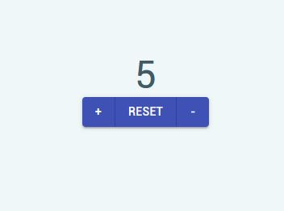

# react-counter



> This project is a simple counter app created with React and to learn the basics of the Material-UI.

---

### Table of Contents


- [Description](#description)
- [How To Use](#how-to-use)
- [References](#references)

---

## Description

This simple project was created to practice React and the UI framework Material UI. The app is a counter with 3 buttons: **+**, **-**, and **RESET**. Each button calls a function that changes the state of the number.

The project provides examples of how to use common components from Material UI with props. The Counter component is written as a functional component so the app provides an example of how to use the useState React hook. There is also a simple example of how to handle clicks for buttons.

#### Technologies

- React **v17.0.2**
- Material-UI **v4.11.4**

[Back To The Top](#react-counter)

---

## How To Use

#### Installation
You can download the repo as a zip file or you can fork it as your own repo.

When you have the files on your local, install the npm packages using:
```
    npm install
```

Run the project using:
```
    npm start
```

#### App Usage
The app itself is simple enough to use. You can click the **+** to add to the counter and **-** to subtract from the counter. Clicking the reset button will **reset** the counter back to 0.

[Back To The Top](#react-counter)

---

## References

- React - https://reactjs.org/docs/getting-started.html
- Material-UI - https://material-ui.com/getting-started/installation/


[Back To The Top](#react-counter)